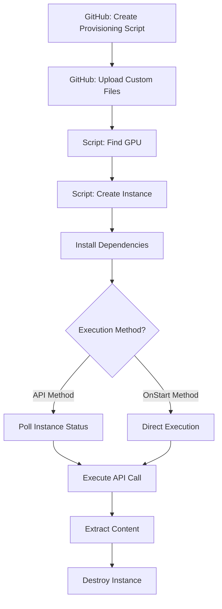

# Vast.ai Workflow

This document outlines the complete workflow for deploying and managing ComfyUI instances on Vast.ai with custom provisioning.

## Prerequisites

### GitHub Setup
- [X] Create provisioning script in repository
- [X] Upload custom files for provisioning script ingestion:
  - [X] Workflows
  - [X] Models
  - [X] Configuration files

### Instance Discovery
- [X] Script to find specific GPU offering that meets requirements
  - [X] Search by GPU type with cost optimization
  - [X] Filter by internet speed and bandwidth costs
  - [X] Sort by total 10-minute cost (compute + download)

## Instance Deployment

### Automated Python Method (Recommended)
The automated method handles the complete workflow from search to ready instance:

```bash
# One command to search, create, and monitor
poetry run python SCRIPTS/python_scripts/create_and_monitor.py
```

**Features:**
- [X] Automatic GPU offer discovery with cost optimization
- [X] Instance creation with selected offer
- [X] Real-time monitoring until ready
- [X] Automatic exit when ComfyUI is accessible

### Manual CLI Method
The manual CLI method creates instances through command-line interface:

1. **Search for Offers**
   ```bash
   poetry run python SCRIPTS/python_scripts/search_offers.py
   ```

2. **Create Instance**
   - [X] Deploy template with custom provisioning script
   - [X] Install performance optimizations:
     - [X] SageAttention for 8-bit attention
     - [X] Triton for custom CUDA kernels
   - [X] Load required models automatically

3. **Monitor Instance**
   ```bash
   poetry run python SCRIPTS/python_scripts/monitor_instance.py <INSTANCE_ID>
   ```

## Execution Methods

### Instance Monitoring

The monitoring script provides real-time status updates:

**Status Stages:**
1. 🔄 **INITIALIZING** - Instance booting up
2. ⚙️ **PROVISIONING** - Running provisioning script
3. ⬇️ **DOWNLOADING** - Downloading models (shows progress)
4. 🚀 **STARTING_APP** - ComfyUI starting up
5. ✅ **READY** - Instance fully ready

**Features:**
- Real-time log monitoring
- Model download progress tracking
- Portal URL discovery
- Automatic SSH key detection
- Exit on ready with success/failure status

### API Method
This method keeps image/prompt/settings on local machine for reference and control.

**Process:**
1. [X] Script checks if instance is ready (via monitoring)
2. [ ] Execute API call with parameters:
   - [ ] Input image
   - [ ] Text prompt
   - [ ] Generation settings

**Advantages:**
- Local control of inputs
- Easy parameter modification
- Real-time status monitoring

### OnStart Method
This method embeds everything within the template, eliminating polling but requiring all assets in instance storage.

**Process:**
1. [ ] Execute API call with pre-loaded parameters:
   - [ ] Input image (stored in instance)
   - [ ] Text prompt (pre-configured)
   - [ ] Generation settings (template defaults)

**Advantages:**
- No polling required
- Faster execution
- Self-contained deployment

## Cleanup

### Post-Processing
1. [ ] Extract generated content to local storage
2. [ ] Download outputs and logs
3. [ ] Destroy instance and storage volume to minimize costs

## Workflow Summary



## Configuration Files

- **Provisioning Script**: `provisioning_scripts/provision_test_1.sh`
- **CLI Templates**: 
  - `vastai_cli_template/ssh/example_cli_command.txt` - Basic template
  - `vastai_cli_template/ssh/example_cli_command_fix.txt` - Single env string format
  - `vastai_cli_template/ssh/example_cli_command_fix_separate_env.txt` - Separate env flags
  - `vastai_cli_template/ssh/example_cli_command_fix_double_quotes.txt` - Windows compatible (recommended)
- **Workflows**: `TEMPLATES/1_workflows/`
